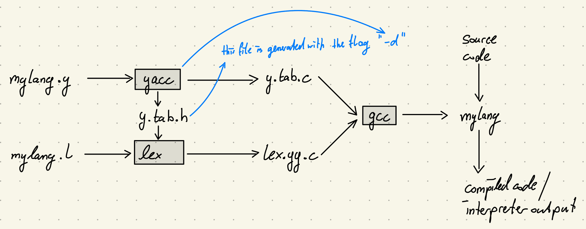
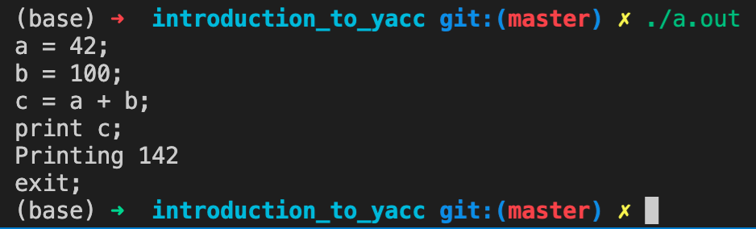

# YACC Introduction

This is a small program to test if the YACC installation is properly running on the machine.

## Building Structure

The structure and sequence of the build steps are shown in the figure below:

## Build Commands

1. `$ yacc -d calc.y`
   1. The `-d` flag is required to produce the `y.tab.h` file that contains the tokens used in the `calc.l` file.
   2. If this flag is omitted, only the `y.tab.c` file is generated.
2. `$ lex calc.l`
3. `$ gcc lex.y.c y.tab.c -o calc`
   1. If an `implicit declaration` error occurs, use the following command:
   2. `$ gcc -Wno-implicit-function-declaration lex.yy.c y.tab.c -o calc`
4. `./calc`

## Sample Interpretation Input

Here is a sample input that is interpreted by the program.

